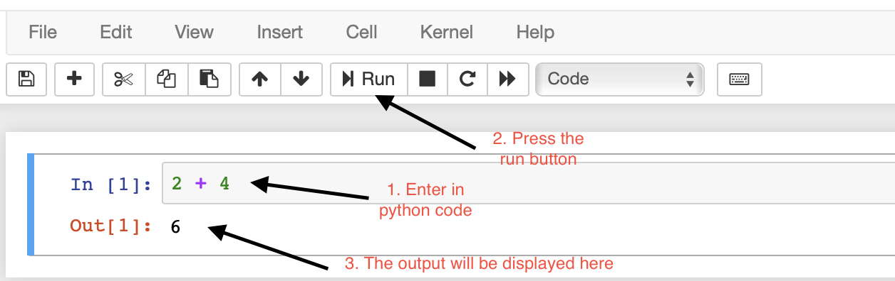
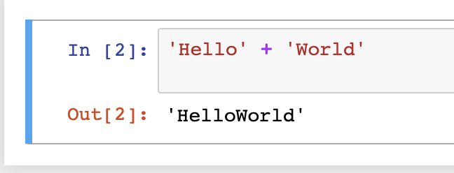
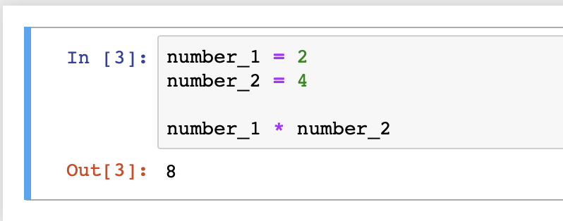
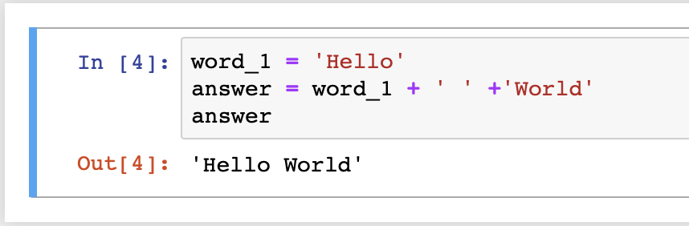
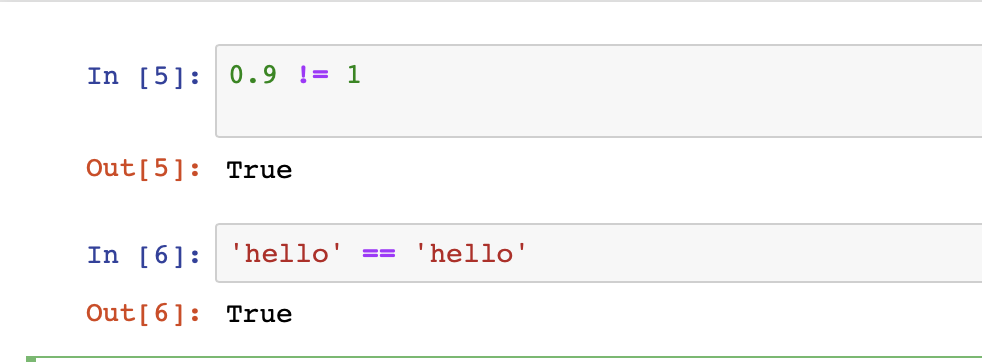
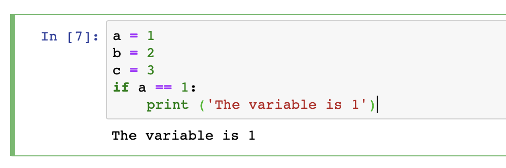
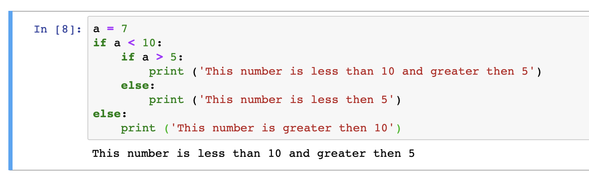
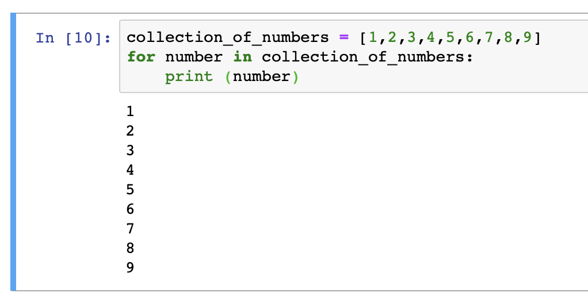

# Python Bootcamp

## Types
The core types in python that we care about for this bootcamp is:
   * bool - A value that is True or False
   * int - A whole number e.g. 1, 2, -5, 1000
   * float - A number with a decimal e.g. 1.99, 0.001, -5.23
   * str - A 'String' is a text sequence e.g. 'Hello', 'Kings college'

### **Task** try some basic arithmetic
```python
2 + 4
5 + 1.9
2.2 - 8.3
1 * 5
4 / 2
```



What happens when we do?:
```python
5 / 0
```

What do you think will happen if you run the following code?
```python
'Hello' + 'World'
```


It is possible to combine string values together using the addition

What if you do the following:
```python
'Hello' + 1
```

It is not possible to combine all types together!

## [Variables](https://www.tutorialspoint.com/python/python_variable_types.htm)

Variables are a symbol that represents a value. We can assign items to values to variables:

```python
number_1 = 2
number_2 = 4

number_1 * number_2
```


We can reassign variables:
```python
number_1 = 5
number_1 * number_2
```
```python
number_1 = 2
number_2 = 5
number_3 = number_1 + number_2
print(number_3)
number_3 = 2
print(number_3)
```

```python
word_1 = 'Hello'
word_1 + ' ' +'World'
```


Variables can be assigned to the answer of an operation
```python
word_1 = 'Hello'
answer = word_1 + ' ' +'World'
answer
```

## [Comparators](https://www.tutorialspoint.com/python/comparison_operators_example.htm)
This is a list of simple comparators you can look up more
   * **==**: Checks to see if the two values are equal
   * **!=**: Checks to see if the two values are NOT equal
   * **<**: Checks to see if the left value is less than  right value
   * **>**: Checks to see if the left value is greater to the right value

What do we get if we do the following:
```python
1 == 1
1 != 2
4 < 5
5 < 4
5 > 4
0.9 != 1
'hello' == 'hello'
'hello' == 'world'
```


What do we get if we do compare the following?
```python
1.0 == 1

a = 'hello'
b = 'hel' + 'lo'
a == b
```

## [If statements](https://www.tutorialspoint.com/python/python_decision_making.htm)
An if statement is concept to execute some code IF a condition is met:
**NOTE - The indentation is MANDATORY and must be a TAB not a space**

An **if** statement is defined as the following:
```
if (A condition is met):
    execute all the code in this indentation
```

```python
a = 1
b = 2
c = 3
if a == 1:
    print ('The variable is 1')
```



Try the following example:
```python
if b == 2:
    print ('The variable is 2')

if c == 2:
    print ('The variable is 2')
else:
    print ('The variable is NOT 2')
```

Notice that there is an **else** here! This can be used to provide an alternative operation when the **if** condition is not met
An **if** statement is defined as the following:
```
if (A condition is met):
    execute all the code in this indentation
else:
    execute all the code in this indentation
```

We can nest if statements as well. What if we want to check to see if a number is less than 10 and greater then 5
```python
a = 7
if a < 10:
    if a > 5:
        print ('This number is less than 10 and greater then 5')
    else:
        print ('This number is less then 5')
else:
    print ('This number is greater then 10')
```



## [for loops](https://www.tutorialspoint.com/python/python_loops.htm)
A for loop is way to look at each value in collection of values
Let us say that we have a collection of values [1,2,3,4,5,6,7,8,9] and we assign this to a variable
```python
collection_of_numbers = [1,2,3,4,5,6,7,8,9]
for number in collection_of_numbers:
    print (number)
```

It is possible to nest conditions in the for loop
```python
collection_of_numbers = [1,2,3,4,5,6,7,8,9]
for number in collection_of_numbers:
    print (number)
    if number == 2:
        print ('Number 2 found')
```



### **Task**
Can you use the for loop code above and modify the code in the for loop to print the following:
```
The number [1] is less than 5
The number [2] is less than 5
The number [3] is less than 5
The number [4] is less than 5
The number [5] is equal to the number 5
The number [6] is greater than 5
The number [7] is greater than 5
The number [8] is greater than 5
The number [9] is greater than 5
```
