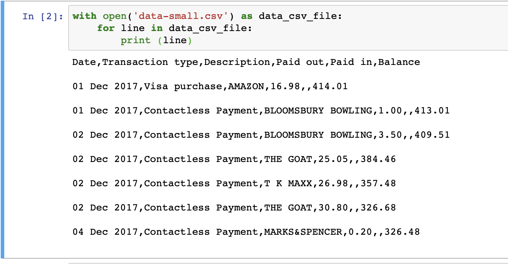

# Task 2

We are going to expand on what we have learned and apply this to a sample bank statement.

If you open up the [data.csv](data.csv) you can see that this data.
A CSV is a Comma Spaces Value. The first line is the headings and the rest of the lines are the values e.g.
```csv
Date,Description,Money In,Money Out,Balance
01/01/2018,McDonalds,20,,80
02/01/2018,Rent contribution,,100,180
03/01/2018,Pub,30,,150
01/01/2018,McDonalds,15,,135
```
If me make it look pretty it looks like the following
```csv
Date,       Description,        Money In,   Money Out,  Balance
01/01/2018, McDonalds,         20,         ,           80
02/01/2018, Rent contribution,  ,           100,        180
03/01/2018, Pub,                30,         ,           150
03/01/2018, McDonalds,         15,         ,           135
```

Our goal is to read in this data.csv file and add up how much money we have spent at McDonalds.

## [Read in a file](https://www.tutorialspoint.com/python/python_files_io.htm)
Copy the data.csv file to the same folder where the jupyter notebook is running. 
Or open up a new jupyter notebook in the Task-2 folder where the data.csv file is.

### Check file exists
Before we continue lets make sure that the file is available
```python
file_name = 'data.csv'
import os
check_file_exists = os.path.isfile(file_name)
if check_file_exists == False:
    print ('Can not find file data.csv')
else:
    print ('Found file data.csv')
```


If you can't find the file check the data.csv is in the correct location.

Lets look at the two new lines of code. This is an overview, and it is not required to understand to continue with this exercise and links are included for offline followup :
   * ```import os``` This is importing a [Module](https://www.tutorialspoint.com/python/python_modules.htm). A module is like a toolbox and we are saying we want to use this toolbox
   * ```os.path.isfile(file_name)``` This is a [function](https://www.tutorialspoint.com/python/python_functions.htm) call. This is saying that we are using the module os (the toolbox os.path) and using its function isfile. This function returns a bool value (True or False) result to say if the file can be found or not

### Read the file in

Now that we know that the file exists we can open it up and read the file. There are two files so for testing lets use the `data-small.csv` file

```python
with open('data-small.csv') as data_csv_file:
    for line in data_csv_file:
        print (line)
```



What do you expect to happen? Run the code and find out

What is the new line of code doing, again this is something that you do not need to understand at the moment?
   * ```with open(file_name) as data_csv_file``` is a much more complex line of code then previously seen.
      * ```with``` is a (context managment statement)[https://docs.python.org/3.7/reference/compound_stmts.html#with],  it is saying that python will run some code behind the scenes to make sure that when we open the file we will also close it correctly so others can use the file again in the future
      * ```open(file_name)``` This is the function to [open](https://docs.python.org/3.7/library/functions.html#open) the file so we can start reading the contents
      * ```as data_csv_file``` This is saying that now we have opened the file we need to give it a name so that we can start reading the contents of the file
    In short this line is saying the following "Safely open up the file 'data.csv' and we will interact with the contents of the file as the variable data_csv_file"

PHEW!! that was a bit complex. On to the next section.

So now the we are able to get access to the lines of the file

## Accessing each element of the CSV file
What would be really convenient is to be able to split each line up and be able to access just the parts that we care about

There is a module called csv which handles for us csv files to make them easy to operate with. Lets extend the example above
```python
import csv
with open('data-small.csv') as data_csv_file:
    csv_reader = csv.reader(data_csv_file)
    for csv_line in csv_reader:
        transaction_date = csv_line[0] 
        transaction_type = csv_line[1]
        description = csv_line[2]
        paid_out = csv_line[3]
        paid_in = csv_line[4]
        balance = csv_line[5]
        print (transaction_date + " " +  description + " [" + paid_out + "]")
```
What do you notice now. In computing we use a zero index which means that instead of starting from one we count from zero

## Adding together all expenses at a Location
```python
import csv
with open('data-small.csv') as data_csv_file:
    csv_reader = csv.reader(data_csv_file)
    for csv_line in csv_reader:
        description = csv_line[2] 
        if description == 'BLOOMSBURY BOWLING':
            print ("We have found a transaction at BLOOMSBURY BOWLING")
```

What if we change this to McDonalds and use all the data!
```python
import csv
with open('data.csv') as data_csv_file:
    csv_reader = csv.reader(data_csv_file)
    for csv_line in csv_reader:
        description = csv_line[2] 
        if description == 'MCDONALDS':
            print ("We have found a transaction at MCDONALDS")
```
We should see "We have found a transaction at McDonalds" appear four times


## Skip the first line
We when we read the file and print out all the lines the first line is the headings of the csv file.

```Date,Transaction type,Description,Paid out,Paid in,Balance```

This does not interest us as we want to start accessing the values so we want to skip the headings line. We could remove it from the file manually, however, lets add this to our program. We can add a check to see what line number we are looking at. Look when we add this to the sample we are working on and what it prints out
```python
import csv
line_number = 1
with open('data-small.csv') as data_csv_file:
    csv_reader = csv.reader(data_csv_file)
    for csv_line in csv_reader:
        if line_number != 1:
            description = csv_line[2] 
            print ('Description for file is ' + description)
        line_number = line_number + 1
```
We now do not see the headings value Description being printed out

## Converting the csv to a different type
When we look at each element of csv python assumes that it is text. We know that it is actually a float, it is a number with decimals, so we need to convert it to that type. We can do the by wrapping the variable in a function ```float()```. Lets put this all together and add 0.99 to each paid out value
```python
import csv
line_number = 1
total = 0.0
with open('data-small.csv') as data_csv_file:
    csv_reader = csv.reader(data_csv_file)
    for csv_line in csv_reader:
        if line_number != 1:
            description = csv_line[2]
            paid_out = csv_line[3]
            new_paid_out_value = 0.99 + float(paid_out)
            print ('Description is ' + description + ' and the new paid out value is ' + str(new_paid_out_value))
        line_number = line_number + 1
```


## Task
With this information can you use what you have learnt to make the code do the following:
   1. Print out how many transactions have been made at EVANS CYCLES. HINT to convert print an integer as string wrap the integer in the function str() e.g. ```print("My favourite number is " + str(42))```
   2. What is the total spent at AMAZON in this statement?
   3. What is the total spent on the '26 Jan 2018'?
   4. What is the total paid in over the last two months?

